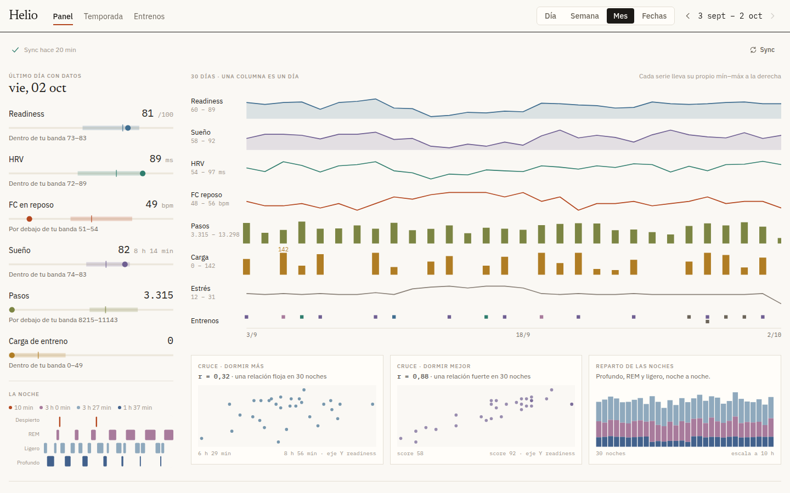
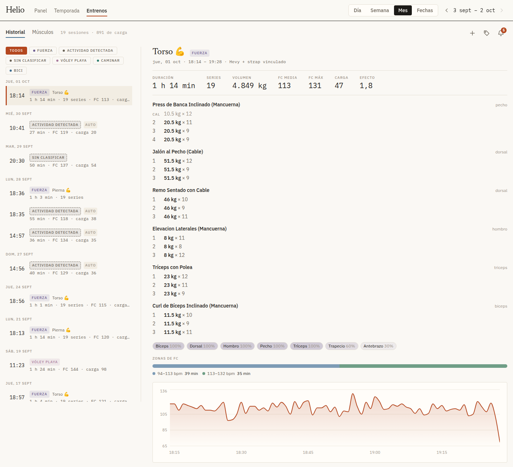
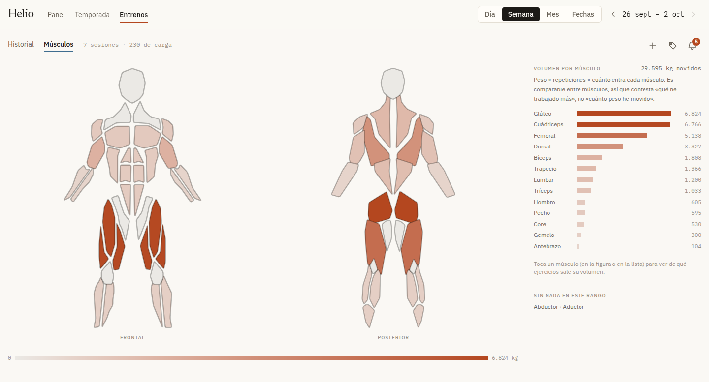

# zepp-dashboard

**Get your health data out of the Zepp/Amazfit cloud and own it.**

Your Amazfit band already measures your heart rate every minute, your sleep
stages, your stress, your recovery. That data lives in Zepp's cloud and comes
back to you only as the screens Zepp decided to draw.

This project pulls it into a local SQLite database, serves it over a small HTTP
API, and renders it in a web app — every layer usable **without the one above
it**. Take the whole stack, or take the fifty lines that fetch a token.

*[Léeme en español](README.es.md)*

---

## ⭐ The session fix and the namespace trick

If you take one thing from this repository, take this. It is not documented
anywhere else, and getting it wrong breaks your phone.

**Zepp allows one session per `app_name`.** The phone app holds
`com.huami.midong`. If your script logs in with that same name, **the backend
evicts your phone**: sync stops, live heart rate stops, until you reopen the app.

> **Log in as `app_name = com.huami.webapp`.** It is a different session slot and
> it coexists with the phone.

But that is only half of it. The `appname` header on **each data request**
selects the *namespace being read*, independently of the session. With
`com.huami.webapp`, your workout history comes back **empty** — the web dashboard
does not expose it.

> **Send `appname: com.huami.midong` on data GETs.** A GET never registers a
> session, so the phone is unaffected.

**Log in as the webapp, read as the phone app.** In code:
[`ingest/auth.py`](ingest/auth.py) (`HEADERS_ZEPP_LOGIN`) and
[`ingest/client.py`](ingest/client.py) (`DATA_HEADERS_BASE`).

The rest of the reverse-engineering — endpoints, payload layouts, sentinel
values, timezone anchors, dead ends — is in **[docs/zepp-api.md](docs/zepp-api.md)**.

---

## The four layers

```
   Zepp cloud (unofficial API)
        │   ingest/     auth · HTTP client · pure parsers
        ▼
   SQLite  data/zepp.db
        │   backend/    FastAPI, aggregation and downsampling
        ▼
   HTTP API  /api/*
        │   frontend/   React + Recharts
        ▼
   Web app
```

Each arrow is a seam you can cut. The parsers do not know a database exists; the
API does not know a web app exists.

## Pick your route

| You want | Read | Time |
|---|---|---|
| **Just look around** — invented data, no account | [Try it](#try-it-without-an-account) | 2 min |
| **Just an API token** for my own account, nothing else | [docs/01-login.md](docs/01-login.md) | 5 min |
| **The data, in my own database** — Postgres, InfluxDB, CSV, whatever | [docs/02-extract.md](docs/02-extract.md) | 20 min |
| **The schema and the HTTP API**, I'll build my own interface | [docs/03-database.md](docs/03-database.md) | 30 min |
| **All of it**, web app included | [docs/04-web.md](docs/04-web.md) | 45 min |
| **How the Zepp API actually works** (reference) | [docs/zepp-api.md](docs/zepp-api.md) | — |

The quickest possible start:

```bash
uv sync
cp ingest/config.example.toml ingest/config.toml   # fill in email + password
uv run python -m ingest.auth                       # -> your app_token
```

---

## Try it without an account

Ninety days of invented data on the real backend and the real web app. No Zepp
account, no config, and nothing of yours is used.

```bash
uv sync
(cd frontend && npm install && npm run build)
uv run python -m demo        # -> http://localhost:8000
```

Everything is clickable and editable: the review queue, labels, workouts. The
data lives in `data/demo.db`. On start it is rebuilt if it is more than three
hours old or from another day, so it always ends close to now (a server that is
already running is not rebuilt). `--reset` throws your edits away. Sync answers
`"modo demo: sincronización desactivada"`.





---

## What you get, if you take everything

- **Heart rate** per minute, with real gaps drawn as gaps
- **Sleep** — hypnogram by stage, score, weekly trend, and **naps**, which the
  payload hides in a separate block most tools drop
- **Stress** — the actual sparse series the app draws, not an internal model
- **BioCharge** split into `mental` and `physical`, which the official app does
  not separate
- **Readiness**, HRV, resting HR, respiratory rate, VO2max, training load, steps
- **Workouts** with HR overlay, heart-rate zones, load and training effect, plus
  a review queue for auto-detected activities
- **Strength**, cross-referenced with [Hevy](https://www.hevyapp.com/): exercise,
  sets, weight and curated muscle group over the strap's physiology — the thing
  the watch cannot do, because it fails to recognise the exercise about 80% of
  the time
- **Annotations** on the timeline ("bad meeting", "double espresso")
- **Weekly volume per muscle** on an anatomical body map
- **Installable on your phone** (PWA) and usable **offline**: the last data you
  saw is there without a connection

## Requirements

- Python ≥ 3.11 and [uv](https://docs.astral.sh/uv/)
- Node ≥ 22, only if you want the web app
- A Zepp account with **email + password**

## Known limitations

- **Email + password only.** SSO (Xiaomi, Google, Apple) and 2FA accounts cannot
  authenticate through this flow.
- **Region.** The API host is configurable but only validated for the EU
  (`eu-central-1`).
- **One device, one account.** Everything here was validated against a single
  Amazfit Helio Strap. Sport codes and payload details may differ on your device
  — see [docs/02-extract.md](docs/02-extract.md#other-devices-and-regions).
- **Single user.** No accounts, no multi-tenancy. `api_token` is one shared
  secret, not a login system.
- **Spanish interface.** The web app (and the API's error messages) are in
  Spanish; the documentation is in English.

## Roadmap

Designed, not built. Absent from the UI rather than stubbed:

- `POST /api/ask` — an AI tab. Context builder over the database, sent to an
  OpenAI-compatible endpoint with a configurable `base_url`, so a local model
  works and your health summary never leaves your machine.
- Intraday respiratory series (currently only the daily median is stored; the raw
  payload is already kept).

## ⚠️ Disclaimer

This project uses an **unofficial, reverse-engineered** Zepp/Huami API. It is not
endorsed or supported by Zepp/Amazfit.

The endpoints **can change or stop working at any time**, and there is a
**theoretical risk of your account being blocked**. Use it at your own risk, with
**your own account and your own data** only.

Provided **"AS IS"**, without warranty — see [LICENSE](LICENSE).

## Licence

[MIT](LICENSE). Third-party assets: [frontend/THIRD_PARTY.md](frontend/THIRD_PARTY.md).
